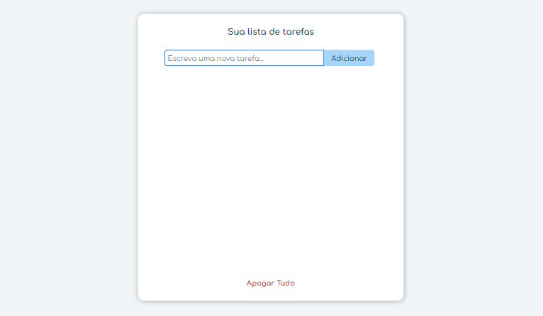
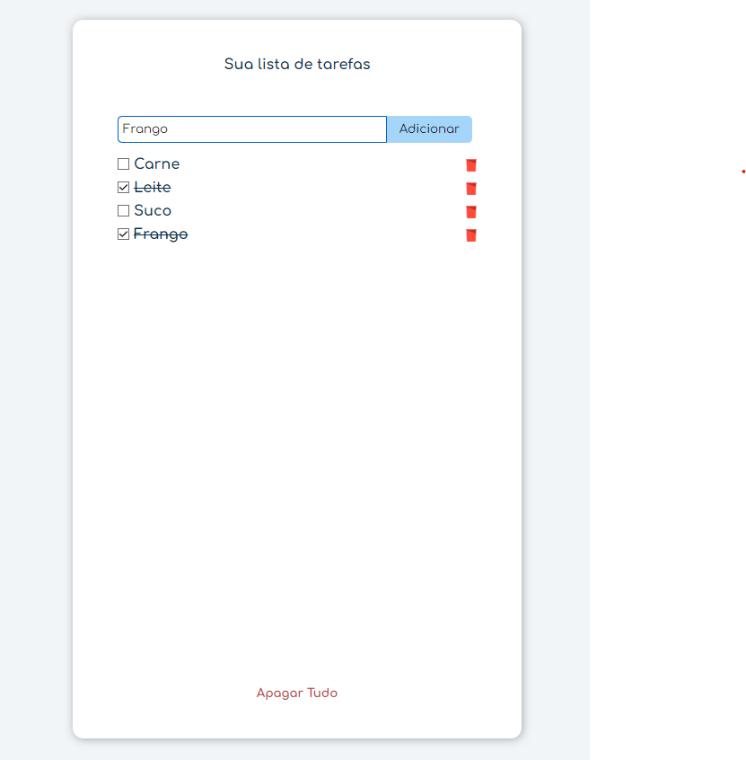
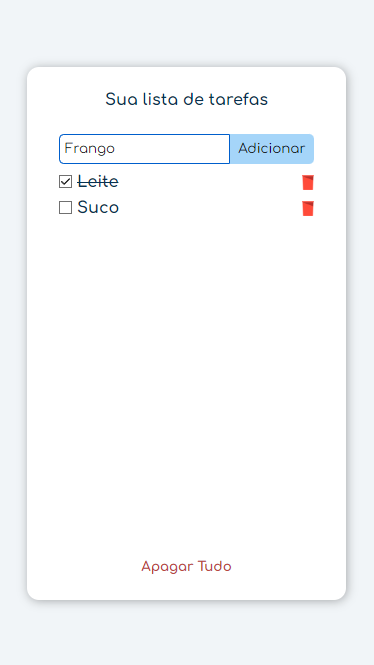

## Lista de Tarefas

## Índice
<a href="#funcionalidades-do-projeto"> Funcionalidades do Projeto </a>

<a href="#layout"> Layouts </a>

<a href="#tecnologias-utilizadas"> Tecnologias Utilizadas </a>

## Funcionalidades do Projeto
- [x] Adição de diversos itens em lista
- [x] Remoção individual de cada item
- [x] Remoção de todos os itens de uma vez só
- [x] Adaptação ao tamanho de tela

## Layout

## Tecnologias Utilizadas
- HTML
- CSS
- JavaScript